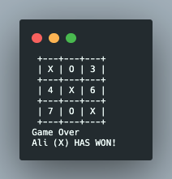

# Tic Tac Toe

> It is a paper-and-pencil game for two players, X and O, who take turns marking the spaces in a 3×3 grid. The player who succeeds in placing three of their marks in a diagonal, horizontal, or vertical row is the winner. It is a solved game with a forced draw assuming best play from both players.

## Built With

- Ruby

## Live Demo

[Live Demo Link]()

## Getting Started

### To get a local copy and play game

### Prerequisites

- Text editor
- GitHub
- Git

#### Clone this repository on to your local PC

- Click on the `Code` (green button)
- By the right end of the read-only input containing the repository link click the clipboard icon to copy the link
- In your local PC, open your terminal in the folder you would like to clone the repository into
- Clone the repository with the command: `git clone https://github.com/SamanAtashi/Tic_Tac_Toe.git`
- After the clone, type in the command `cd TicTacToe` to access the directory on the terminal

#### Play the game

- After clonning the project, run ./bin/main.rb at the root of the project in the terminal.
- Enter names of two players, first player will play with X and the second with O.
- Players will take turns marking their spots on the board.
- The first player who matches three spots in a horizontal, vertical, or diagonal row. is the winner.
- When the spots on the board are all marked with no matches, then, the game ends in a draw.

## About the game

Tic-tac-toe is a  game for two players, X and O, who take turns marking the spaces in a 3×3 grid. The player who succeeds in placing three of their marks in a diagonal, horizontal, or vertical row is the winner. If all nine squares are full, and there is no winner, the game ends in a draw.
For more information about Tic-tac-toe visit [Wikipedia](https://en.wikipedia.org/wiki/Tic-tac-toe)

## If you want to play Tic-tac-toe online, follow this link:
[Tic-tac-toe]()

## Author

:bust_in_silhouette: **Saman Atashi**

- GitHub: [@SamanAtashi](https://github.com/SamanAtashi)
- Twitter: [@AtashiSaman](https://twitter.com/AtashiSaman)
- LinkedIn: [@saman-atashi](https://www.linkedin.com/in/saman-atashi-9539911b0)

## :handshake: Contributing

Contributions, issues, and feature requests are welcome!
Feel free to contribute

## Show your support

Give a ⭐️ if you like this project!
